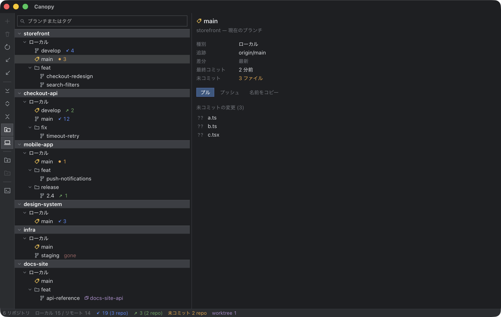
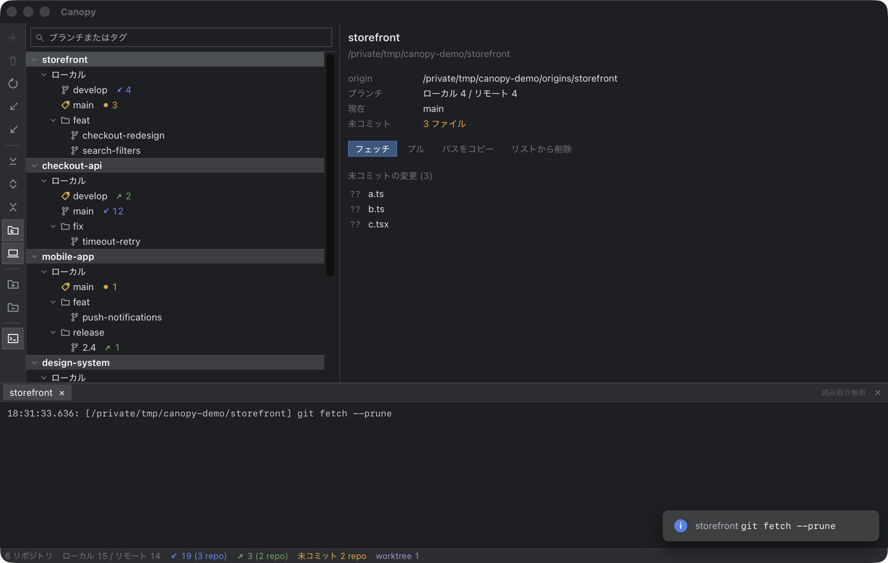

<div align="center">


# Canopy

**複数の git リポジトリのブランチを、1 つのツリーで俯瞰する macOS アプリ。**

取り込み待ちのリポジトリがどれかを、操作せずに把握できます。

[](https://github.com/siropaca/canopy/actions/workflows/check.yml)
[](LICENSE)
[](#動作環境)



</div>

## なぜ作ったか

リポジトリを 10 個前後またぐ開発では、「どれに取り込む変更があるか」を知るだけで、
ターミナルを何度も切り替えるか、リポジトリごとにウィンドウを開くことになります。

Canopy はそこだけを引き受けます。  
全リポジトリのブランチを縦に並べて、**取り込み待ち・送信待ち・未コミットを常に表示**します。

## できること

- **複数リポジトリを 1 画面で** — リポジトリごとのブランチツリーを縦に並べる
- **ブランチ中心** — ローカル / リモート / タグをツリーで。スラッシュはディレクトリに畳む
- **状態が一目で分かる** — 取り込み待ち `↙` / 送信待ち `↗` / 未コミット `●` / ワークツリー / 追跡ブランチの消失
- **操作** — チェックアウト、フェッチ、プル、プッシュ (強制プッシュを含む)、ブランチ名の変更、ブランチの削除
- **勝手に追いつく** — ターミナルで git を動かしても、`.git` の変化を見て画面が追いつく
- **横断検索** — 全リポジトリのブランチとタグをまとめて絞り込む
- **コンソール** — 実行した git コマンドと出力をそのまま見られる



## 動くもの

**外部への通信をしません。** git を実行するだけで、リポジトリの情報がローカルの外に出ることはありません。  
認証も `.gitconfig` も、ターミナルで使っているものがそのまま効きます。

- ウィンドウを閉じてもプロセスは残ります。メニューバーのアイコンから戻せます
- 楽観的更新をしません。操作のあとは git から読み直すので、画面と実態がずれません
- 同じリポジトリへの書き込みは直列に実行します。`index.lock` の競合が起きません

## 動作環境

- macOS 14 以降
- git 2.24 以降 (`git switch` と `--end-of-options` を使います)

## インストール

リリースビルドはまだ配布していません。手元でビルドしてください。

```sh
git clone git@github.com:siropaca/canopy.git
cd canopy
mise install     # Node・pnpm・Rust
pnpm install
pnpm tauri build
```

`src-tauri/target/release/bundle/macos/Canopy.app` ができるので、`/Applications` に置きます。

## 開発

```sh
pnpm tauri dev   # 開発ビルドで起動する
pnpm check       # 型・lint・整形・テスト・ビルド・Rust・ドキュメントを通す
```

コマンドの一覧と命名の規約は [docs/development.md](docs/development.md)。  
実装の進め方 (テスト駆動、レビュー、ADR の運用) は [AGENTS.md](AGENTS.md)。

## 仕組み

```
┌─ WebView (React + TypeScript) ─┐
│  ツリー / 詳細 / コンソール       │
└───────────┬────────────────────┘
            │ invoke / event
┌───────────┴────────────────────┐
│  Rust (Tauri)                  │
│  コマンド・キュー・設定の永続化    │
└───────────┬────────────────────┘
            │ tokio::process
         ┌──┴──┐
         │ git │
         └─────┘
```

| ドキュメント | 内容 |
| --- | --- |
| [docs/architecture.md](docs/architecture.md) | プロセス構成、レイヤ、データフロー、並行性 |
| [docs/specs/](docs/specs/) | UI・git 操作・データモデルの仕様 |
| [docs/adr/](docs/adr/) | 設計判断とその理由 |
| [docs/testing.md](docs/testing.md) | テストの層と、テストが効いているかの確かめ方 |
| [docs/security.md](docs/security.md) | IPC の境界と、外部コマンド実行の安全策 |

主な選択。

- **Tauri + React** — 常駐させたいので、メモリとバイナリの小ささを優先しました ([ADR-0001](docs/adr/0001-tauri-react.md))
- **git はライブラリではなく CLI を呼ぶ** — 認証と設定がそのまま効き、出力をコンソールに出せます ([ADR-0002](docs/adr/0002-git-cli.md))
- **書き込みはリポジトリごとに直列化** — 読み取りは共有ロックで並列 ([ADR-0009](docs/adr/0009-concurrency-and-refresh.md))
- **`.git` を監視して自動で読み直す** — ターミナルでの操作が画面に追いつきます ([ADR-0022](docs/adr/0022-auto-refresh.md))

## これから

コミット、差分とログの表示、リベースとマージ、ブランチの作成は入っていません。  
線引きの理由は [ADR-0007](docs/adr/0007-v1-scope.md) にあります。

## ライセンス

[MIT](LICENSE)
